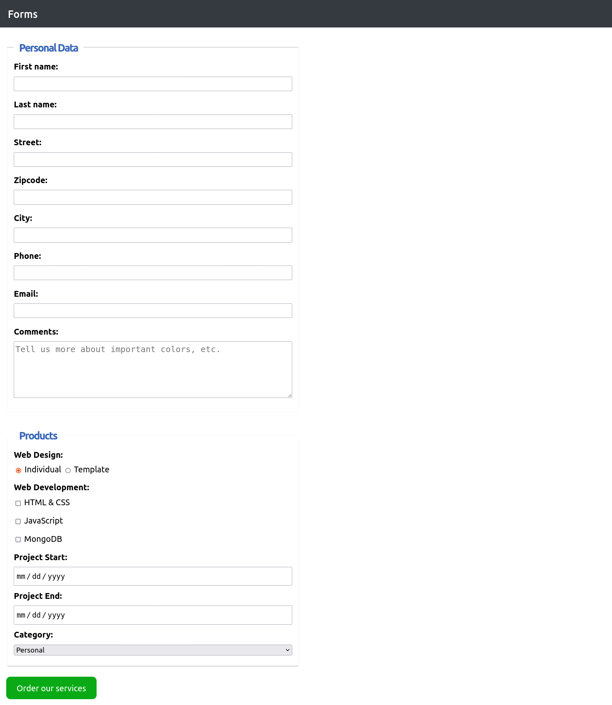

# FORM

## Form - structure and styling

### About Project

This is an exercise that I completed during my studies at DCI, and after completing the assigned tasks, I went even further and had a little fun with the transformation.

### How to use this Project

You can look at the code or just have some fun with the live version.

##### Developed With:

- [x] _HTML5_
- [x] _CSS3_
- [x] _git_
- [x] _box-sizing_
- [x] _position_
- [x] _color_
- [x] _outline_
- [x] _transform_

### Contact

Mail: <sgudzenova@gmail.com> 
GitHub: [saby-gaby](https://github.com/saby-gaby) 
LinkedIn: [Sabina Gudzenova](https://www.linkedin.com/in/sabina-gudzenova-3a8753234/)

### Used Tools

- [Visual Studio Code](https://code.visualstudio.com/)
- [MDN Web Docs](https://developer.mozilla.org/en-US/)

### Have a nice and sunny day! 🌞